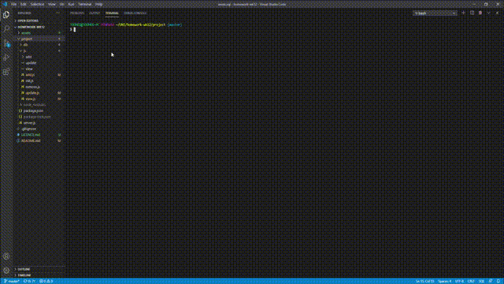

# Employee Tracker CMS

Content Management System to track employee information being accessed from a MySQL database
    
## Table of Contents
* [Installation](#installation)
* [Usage](#usage)
* [Licence](#licence)
* [Contributing](#contributing)
* [Tests](#tests)
* [Questions](#questions)
    
    
## Installation:
    npm install

    AND run schema.sql and seeds.sql in the MySQL workbench
    
## Usage
In a CLI using NODE.js run: 
    
    node server.js
    setting the password for your MySQL workbench in server.js
    
## Licence
This project is licensed under the terms of the MIT.

    
## Tests

[Test Video](./assets/output.mp4)
    
## Questions
GitHub: https://www.github.com/djtoohey/
    
Email: declan@declantoohey.com